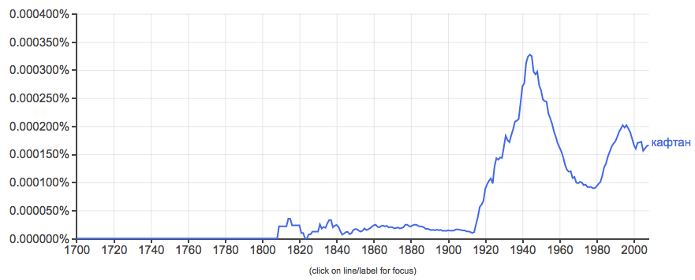
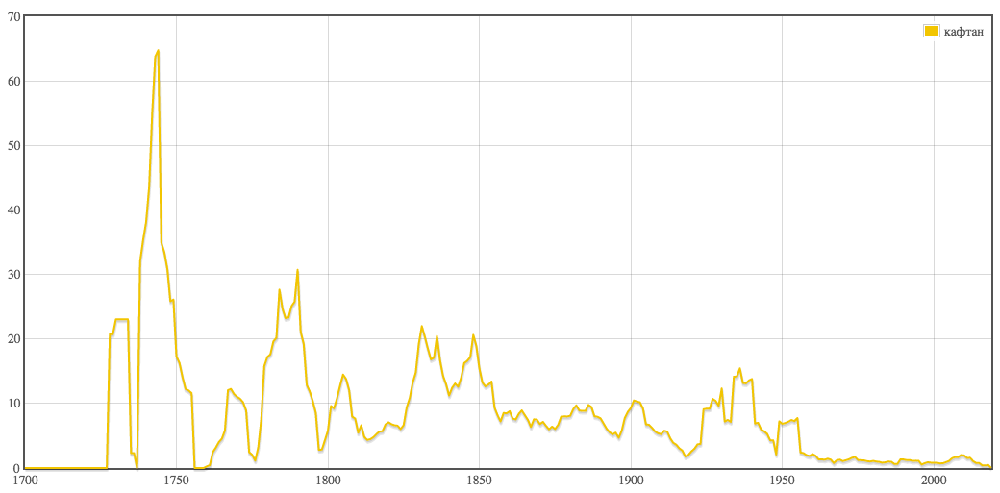

# HW3

Первая часть:

а) Устаревшие слова:

1)

2)

3)

б) N-грамы
 

в) Коллокаты
 

Вторая часть:

1) Хмель, пиянство, пьянство:
 

 

 
Сложно причислить "хмель" прямо-таки к устаревшему слову, но в контексте опьянения в современном языке оно используется довольно редко. Гораздно чаще можно встретить однокоренные слова с "пьянством", именно поэтому я и сгруппировала эти три слова, взяв за современный аналог "пьянство". По обеим таблицам можно заметить, что слово "пьянство" появилось едва ли не раньше "хмеля" и "пиянства". По мнению google-ngram слово "пиянство" почти не использовалось, и это довольно объяснимо: google-ngram всё-таки больше ориентирован на иностранные языки. Судя по НКРЯ "пьянство" и "хмель" теряют популярность, google-ngram наоборот указывает на подъем, для "пьянства" по крайней мере точно. Кто больше прав, если честно, мне сказать довольно сложно.
 
2) Кафтан:
 

 

 
"Кафтан" обозначает специфический вид одежды, которую люди больше не носят, потому я не смогла подобрать ему современных аналогов. Скорее всего, частота использования падала и падает с частотой ношения этих самых "кафтанов". Сложно представить на сегодняшний день кого-нибудь в кафтане на улице.
 

Третья часть:
1) Как помогло в понимании текста: как человек, который придерживается старомодных взглядов ("Механический анализ текста – зло", – вот такого рода), думаю, подход интересный, но неправильный. Поэтому, вероятно, из-за моей предвзятости, текст мне понять лучше не удалось. Может быть, свою роль сыграло и то, что мне приходилось довольно быстро пробегаться глазами, потому что задания были в основном на поиск и анализ отдельных слов. В двух словах: понятия не имею, о чем был мой отрывок и поэма в целом.
2) Узнала много нового и, думаю, далеко не все поняла. Даже не уверена, что сделала домашнюю работу правильно, если уж предельно честно.
3) Думаю, AntConc полезный, скорее всего, даже встречусь с ним в будущем, если и правда смогу устроить себе филологическую карьеру. Сложно конечно, но поиск слов удобный, да и в принципе, пока я выучусь, есть все шансы, что вся система упростится. Несмотря на первый пункт, я понимаю, что периодически выискивать отдельные слова/словосочетания и анализировать частоту их использования может пригодится даже такой привереде, как я. Делать все это своими силами из книжек довольно сложно.
