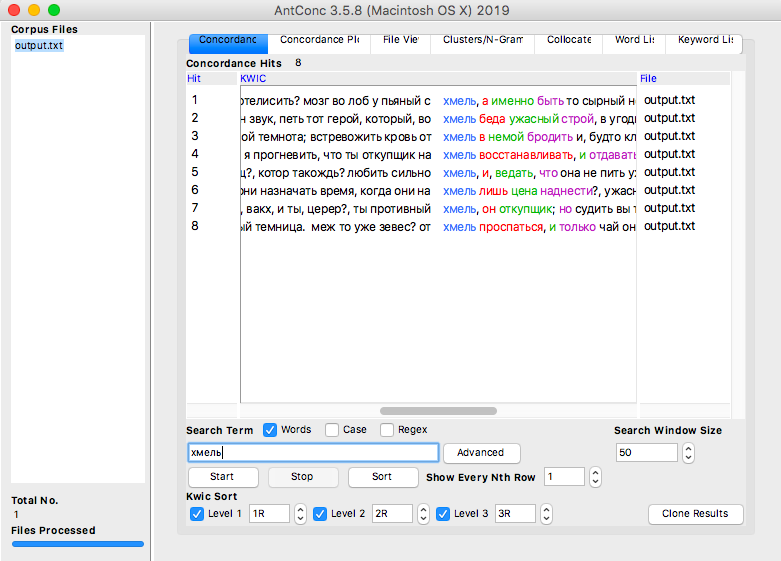
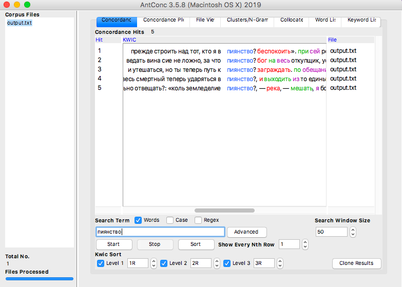
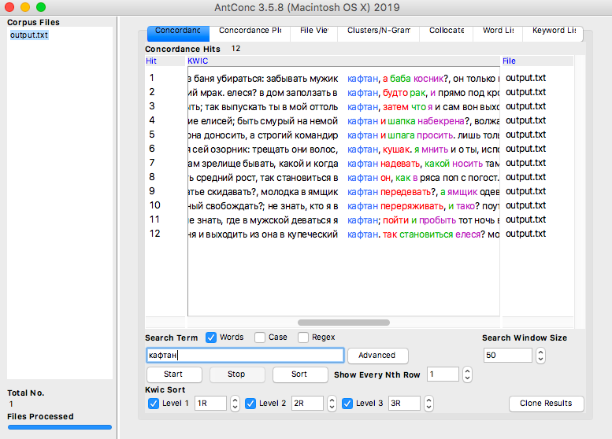
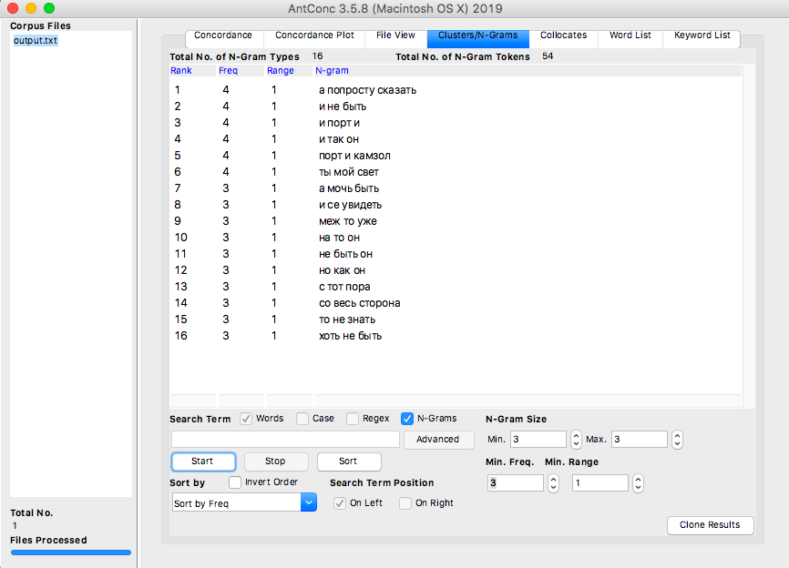
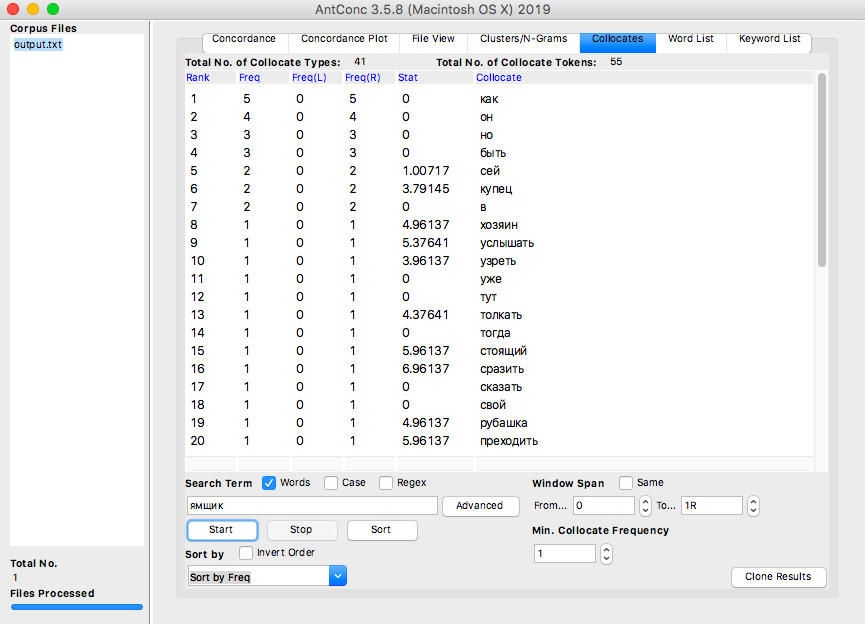
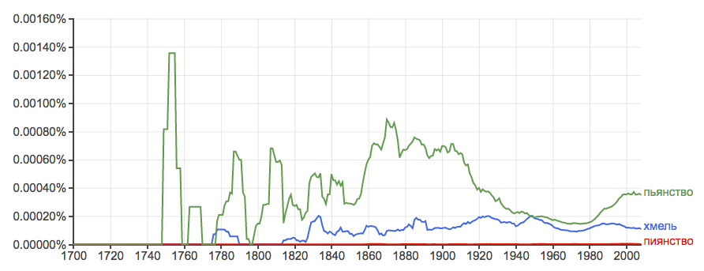
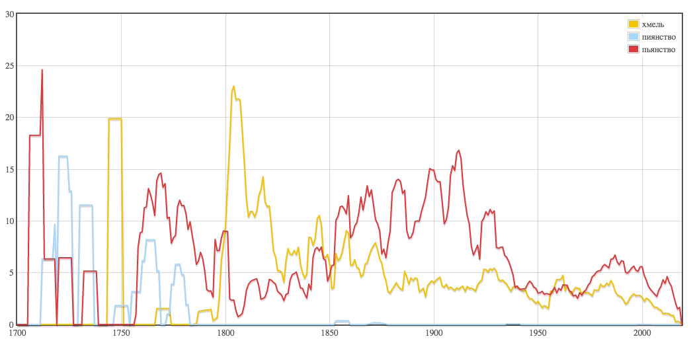

# HW3

Первая часть:

а) Устаревшие слова:

1)

2)

3)

б) N-грамы
 

в) Коллокаты
 

Вторая часть:

а)

1) Хмель, пиянство, пьянство:
 

 

 
Сложно причислить "хмель" прямо-таки к устаревшему слову, но в контексте опьянения в современном языке оно используется довольно редко. Гораздно чаще можно встретить однокоренные слова с "пьянством", именно поэтому я и сгруппировала эти три слова, взяв за современный аналог "пьянство". По обеим таблицам можно заметить, что слово "пьянство" появилось едва ли не раньше "хмеля" и "пиянства". По мнению google-ngram слово "пиянство" едва ли вообще использовалось, и это довольно объяснимо: google-ngram всё-таки больше ориентирован на иностранные языки. Судя по НКРЯ "пьянство" и "хмель" теряют популярность, google-ngram наоборот указывает на подъем, для "пьянства" по крайней мере точно. Кто больше прав, если честно, мне сказать довольно сложно.
